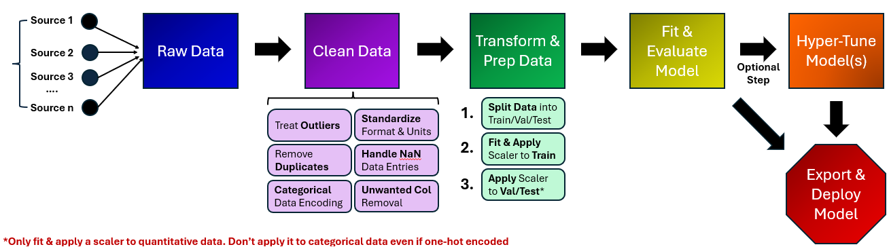
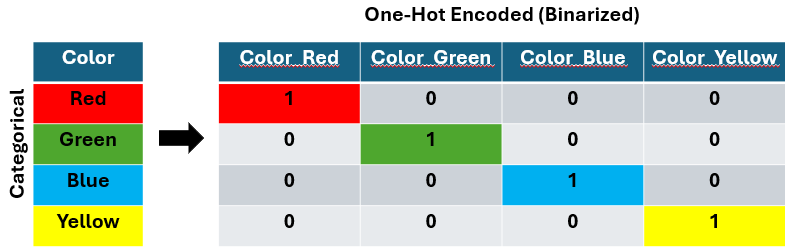
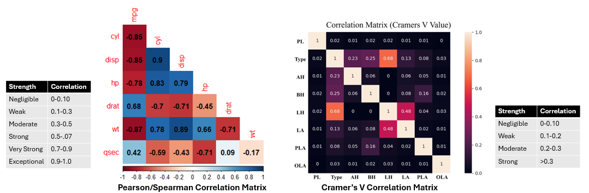
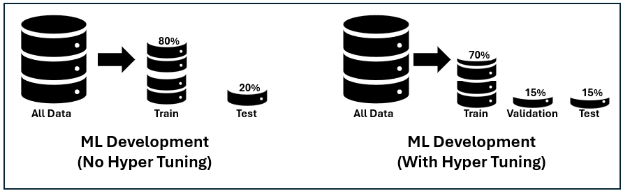
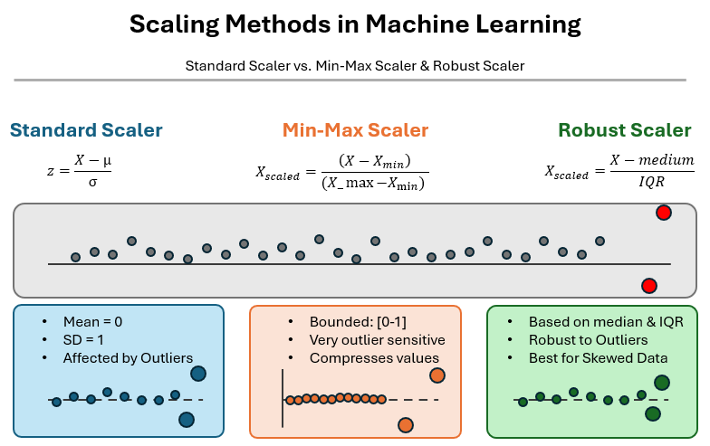
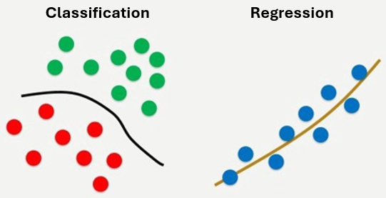
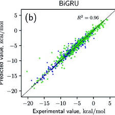
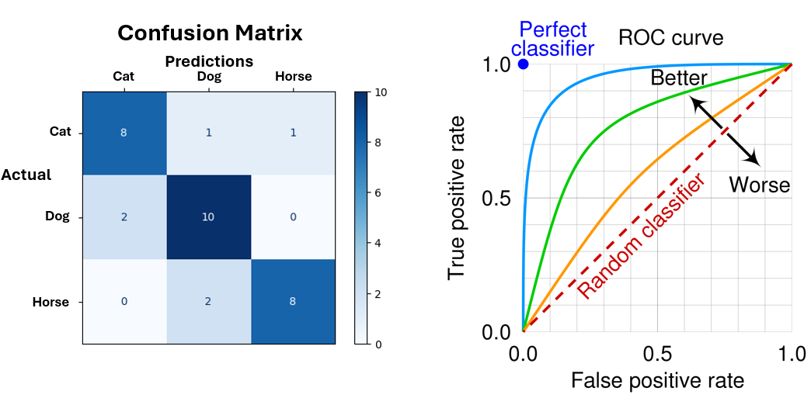
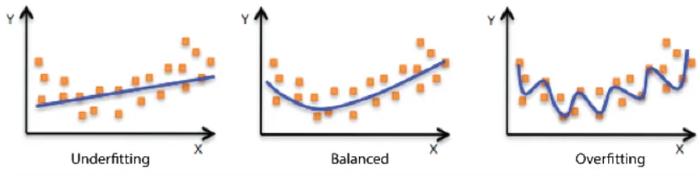
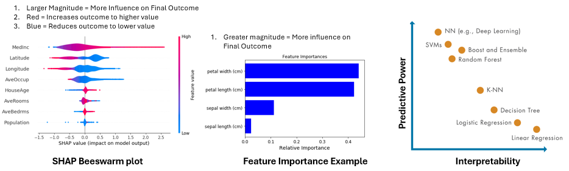

## 1.0 Intro to Machine Learning:
**Prepared by** Matt Jones, M.S. Data Science, B.S. Chemical Engineering<br>
**Copyright:** CC-BY 4.0


---

### Table of Contents <a id="table-of-contents"></a>

 [Background](#background)<br>
 [Model Types / ML Frameworks](#ml-frameworks)<br>
 [Preparing Data for ML Training](#preparing-data-for-ml-training)<br>
 &nbsp;&nbsp;&nbsp;&nbsp;[A) General Process](#a-general-process)<br>
 &nbsp;&nbsp;&nbsp;&nbsp;[B) Data Cleaning](#b-data-cleaning)<br>
 &nbsp;&nbsp;&nbsp;&nbsp;[C) How to Know What Features to Include?](#c-how-to-know-what-features-to-include)<br>
 &nbsp;&nbsp;&nbsp;&nbsp;[D) Transform & Prep Data](#d-transform-and-prep-data)<br>
 &nbsp;&nbsp;&nbsp;&nbsp;[E) Model Training: Classification & Regression](#e-model-training--classification-and-regression)<br>
 &nbsp;&nbsp;&nbsp;&nbsp;&nbsp;&nbsp;&nbsp;&nbsp;[E.1 Regression ML Models](#e-1-regression-ml-models)<br>
 &nbsp;&nbsp;&nbsp;&nbsp;&nbsp;&nbsp;&nbsp;&nbsp;[E.2 Training Classification ML Models](#e-2-training-classification-ml-models)<br>
 &nbsp;&nbsp;&nbsp;&nbsp;[F) Evaluating ML Performance](#f-evaluating-ml-performance)<br>
 &nbsp;&nbsp;&nbsp;&nbsp;[G) Hyper Parameter Tuning](#g-hyper-parameter-tuning)<br>
 &nbsp;&nbsp;&nbsp;&nbsp;[H) Scoring Mechanisms](#h-scoring-mechanisms)<br>
 &nbsp;&nbsp;&nbsp;&nbsp;[I) Model Export](#i-model-export)<br>
 &nbsp;&nbsp;&nbsp;&nbsp;[J) How to Estimate Uncertainty](#j-how-to-estimate-uncertainty)<br>
 &nbsp;&nbsp;&nbsp;&nbsp;[K) Model Explainability](#k-model-explainability)
 
 ---

<a id="background"></a>

### Background
This notebook provides a crash-course training on how to apply machine learning for engineering. We'll highlight: 
* Various Machine Learning Frameworks 
* How to preparing data for Machine Learning 
* How to train regression-based ML models using `Scikit-Learn` 
* How to train classification models using `Scikit-Learn` 
* How to perform hyper-parameter tuning for optimal model performance 
* How to export models for deployment
* How to estimate uncertainty for different ML models. 
* Bonus: how to train neural networks

Let's get Started.... 

----

<a id="ml-frameworks"></a>

### Model Types / ML Frameworks

| ML Framework | Core Idea | Model Types | Use Cases | Non-linear Capable? |
|----------------|---------|--------------|---------|---------|
| Generalized Linear Regression | Learn a weighted sum of features | Linear Regression, Lasso, Ridge, Elastic-Net, Poisson Regression | interpretation matters, relationships are simple, and speed is paramount | No |
| Tree-Based Models | Break data into series of sequential decisions in a flow-chart manner | Decision Tree, Random Forest, Gradient Boosted Trees, Isolation Forests | Often best default for tabular structured data | Yes |
| Probabalistic Models | Utilize Probability Distributions to Model Uncertainty Explicitely | Naive Bayes, Bayesian Linear Regression, Gaussian Processors, Hidden Markov Models, Bayesian Neural Networks | Limited data, Need interpretability and to know their a-priori dependencies | Yes |
| Distance-Based Models | Predictions should be made based on similarities | K-Nearest Neighbors, DBSCAN, Kernel Regression, LOESS/LOWESS | Low-Dimensionality Data, Similarity-based reasoning, small datasets | Yes |
|Kernel Methods| Map data into higher dimension spaces to make predictions | Support Vector Machines, Radial Basis Function, linear & polynomial kernels, Neural Network Gaussian Processors | High Dimensionality Features, medium amount of data, well-separated classes | Yes -- Depending on Method |
| Synaptic Models | Learn hierarchical feature representations | Neural Networks (ANN, CNN, U-NET, GNN, RNN, LSTM, Transformers, Auto-encoders) | very large datasets, very complex features | Yes |
| Dimensionality Reduction & Representation Learning | Compress data but preserve structure | PCA, t-SNE, UMAP | Reduce Noise, Visual clustering, Pre-processing | Yes -- Depending on Method |

<a id="preparing-data-for-ml-training"></a>

---
### Preparing Data for ML Training:




*Figure 1: General ML Pipeline*

<a id="a-general-process"></a>

#### A) General Process:
To prepare the data for ML training we'll first aggregate our raw data from any sources required. Then we pre-process the data, excluding features we don't want, and cleaning the features we do. After cleaning the data we split the data into training and test sets, and then scale the data for training. Finally we load our model structure, fit to training data, and evaluate it on test data. If the performance is desirable, we export the model, otherwise, we proceed with hyper-parameter tuning and/or we explore other model structuress.  

<a id="b-data-cleaning"></a>

#### B) Data Cleaning:
**Standardization, Outliers, NaNs, and Duplication** <br>During cleaning, we apply any and all steps necessary to format the data into a usable set of information for model training. The most common thing we'll need to do is standardize the format & units between data sources so all the records are on the same basis (ex. temperature all in celsius). It is also common in datasets that our information is incomplete. So we have to decide how to deal with missing / partial entries. In some cases, dropping entire records due to missing values is impractical / expensive, we may fill the value with a prior value, future value, or some other value (0, mean, median, etc.). To train the model efficiently, we only want to use features if they do not leak unintended information about the records, and so long as the feature is meaningful/useful. On a similar thread if there are duplicated records, we can condense to just unique records since repeated entries will not improve/support the model's capability.


*Figure 2: Data Cleaning Example*

**Categorical Data Management: One-Hot Encoding**  <br>
If we have categorical data (up/down, red/blue, american/european), then we'll need to translate that to quantitative data through a process known as "One-Hot" encoding. To apply one hot encoding we simply split our data between quantitative and categorical data. Then we call the `OneHotEncoder`from the `sklearn.preprocessing` library on the categorical data. This will explode the columns because each "category" becomes a binary "0/1" entry designating it's true state. Because of this, categorical data generally requires many more records to train with. If possible, it's ideal to relate the categorical data to a true quantitaive variable instead. For example, instead of using Anode/cathode chemistry in a ML dataset consider the explicit chemical compositions which are continuous and quantitative in nature.     




*Figure 3: One-Hot Encoding*

<a id="c-how-to-know-what-features-to-include"></a>

#### C) How to Know What Features to Include?
Our training dataset may have many columns of features, so how do we know which ones should be included in a model? 
<br>We can conduct correlation analysis to so see how well changes in one feature, are captured by another feature. For **quantitative data, consider using the pearson or spearman correlation** if your data is linear and monotonic. 
* Use correlation matrices to assess feature significance
* Use Spearman if you have outliers 
* Use Pearson if you don't have outliers 
* Use Cramer's V if you have categorical features

Pearson seeks to address whether features increase/decrease linearly against eachother. Spearman addresses whether features have a tendancy to increase/decrease with respect to another feature even if it doesn't occur linearly. Meanwhile, Cramer's V addresses whether two categories are related at all. 

**Importantly: Pearson and Spearmon do not account for interactions**. Low correlations can generally be ignored, but capturing 2nd and 3rd order effects may be lost from feature exclusion.

For **categorical data consider the Cramer's V correlation to assess relationships between features**. *Note, the Cramer's V correlation is computationally expensive & requires coding a particular solution as it is not natively supplied in various python packages.*

<u>For a dataset with features, you can execute a pearson or spearman correlation as follows: </u>
```python
import pandas as pd
import matplotlib.pyplot as plt 
import seaborn as sns 

df = pd.read_csv('your_datafile.csv')
corr_matrix = df.corr(method='pearson')
corr_matrix = df.corr(method='spearman')

plt.figure(figsize=(8, 6)) # Set the size of the Matplotlib figure
sns.heatmap(corr_matrix, annot=True, cmap='coolwarm', fmt=".2f", linewidths=.5)
plt.title('Pearson Correlation Matrix Heatmap')
plt.tight_layout()
plt.show()
```

<br>
<u>Here's an example script to execute a Cramer's V Correlation:</u> 
<br>This is just an example for two features. You'd have to apply this function for each (i,j) pair for every row (i) and column (j) in your feature dataset. 


```python 

import numpy as np
import pandas as pd
from scipy.stats import chi2_contingency


def cramers_v(x, y):
    # Build contingency table
    contingency_table = pd.crosstab(x, y)

    # Chi-square test
    chi2, _, _, _ = chi2_contingency(contingency_table)

    n = contingency_table.sum().sum()
    r, k = contingency_table.shape

    return np.sqrt(chi2 / (n * (min(r, k) - 1)))

data = pd.DataFrame({
    "gender": ["M", "F", "F", "M", "M", "F", "M", "F"],
    "recidivism": ["Yes", "No", "Yes", "Yes", "No", "No", "Yes", "Yes"]
})

v = cramers_v(data["gender"], data["recidivism"])
print(f"Cramér's V: {v:.3f}")




*Figure 4: Feature Correlations*
<sup>1, 2 </sup>

**Feature engineering** is the process by which we identify and/or create the features we will use for ML modeling. Sometimes model performance can be significantly improved by expanding the features to consider "free" variables from known relationships. For example, in problems where length, width, and heights are known, it could be useful to include the volume, surface area to volume ratio, or ratios of the different dimensions to each other. This type of feature engineering gives us a new lense on the how the outcome could be perceived through different relations. 

**The goal of feature engineering** is to **improve model fidelity, without significantly complicating the model**. 

<a id="d-transform-and-prep-data"></a>

#### D) Transform and Prep Data
**Splitting the Dataset Up**<br>
After cleaning our training data, we perform the final preparations before training a model. We split the dataset into 2 or 3 groups so we have a specific portion used to train the model, and another portion used to benchmark model performance on an unseen dataset (this is our test data). If you are building a deep-learning model (neural network), or performing complex hyper parameter tuning on a model like SVM, XGBoost, or Random forest, then another dataset is used specifically to tuning the hyperparameters. Through this process, feature relations & hyper parameters are learning on the training and validation sets respectively, while evaluation is performed on test. 

The particular propotions that we use to train, validate, and test models will vary depending on the depth & complexity of the data and its feature relations. It is typical however to start with a blanket 80/20 for training vs. test if validation is not being performed, and 70/15/15 if the data is split between training, validation, and test.  




*Figure 5: Splitting Data for Model Training*

**Applying a Scaler to the Data**<br>
After splitting the data between train and test groups, we then fit and apply a scaler. The intent of the scaler is to ensure fair feature distribution, prevent numerical instability, and achiever faster model training with better convergence. There are 5 common scalers to use, `StandardScaler`, `MinMaxScaler`, `RobustScaler`, `MaxAbsScaler`, and `Normalizer`. <br><br>The `StandardScaler` adjusts the data so it has a mean of 0 and standard deviation of 1. <br>The `MinMaxScaler` re-distributes the data to be between 0 and 1, <br>The `Robust Scaler` centers data around the median, <br> The`MaxAbsScaler` shifts data between -1 and +1, dividing each entry by the largest absolute value of the feature, and <br>The `Normalizer` scales each row instead of each feature, to keep the proportions of each row    





*Figure 6: Comparing Scalers*

**Example Scaling Code:**<br>
```python
import pandas as pd 
from sklearn.preprocessing import StandardScaler
from sklearn.model_selection import train_test_split

df = pd.read_csv('dummy_data.csv')
X_data = df.drop(columns=['Revenue'])
y_data = df[['Revenue']]

X_train, X_test, y_train, y_test = train_test_split(X_data, y_data, test_size=0.2, random_state=42)

scaler = StandardScaler()

# Fit scaler ONLY on training data
X_train_scaled = scaler.fit_transform(X_train)

# Use same scaler to transform test data
X_test_scaled = scaler.transform(X_test)
```

<a id="e-model-training--classification-and-regression"></a>

#### E) Model Training: Classification and Regression

Most of the work in training an ML model is spent on preparing the right type of data with the right features to train a predictive model. Exploring different model frameworks and hyper-tuning their parameters can be very time-consuming, but the act of training the ML models is usually rather simple unless you are training a deep learning model. For non-deep learning models, we can train an ML model by importing the package, loading the base model, and fitting it to our dataset. 




*Figure 7: Classification & Regression*<sup>3</sup>

<a id="e-1-regression-ml-models"></a>

##### E.1 Regression ML Models

Here's an example of training a regression-based model, from many regression ML packages 

```python
#Example Model Package Imports: 
from sklearn.linear_model import LinearRegression
from sklearn.ensemble import RandomForestRegressor
from sklearn.linear_model import Ridge
from sklearn.linear_model import Lasso
from sklearn.svm import SVR
from sklearn.linear_model import ElasticNet
from sklearn.ensemble import GradientBoostingRegressor
from sklearn.neighbors import KNeighborsRegressor
from sklearn.ensemble import ExtraTreesRegressor
from sklearn.ensemble import AdaBoostRegressor
from sklearn.linear_model import HuberRegressor
from sklearn.linear_model import BayesianRidge
from sklearn.linear_model import PoissonRegressor

#Load model 
model = LinearRegression()
model = RandomForestRegressor()
model = SVR()

#Fit model
model.fit(X_train, y_train)

#Make Prediction
y_pred = model.predict(X_test)


```

<a id="e-2-training-classification-ml-models"></a>

##### E.2 Training Classification ML Models

Here's an example training a classification-based model from various classification algorithms.

```python
#Example Model Package Imports: 
from sklearn.linear_model import LogisticRegression
from sklearn.neighbors import KNeighborsClassifier
from sklearn.svm import SVC
from sklearn.tree import DecisionTreeClassifier
from sklearn.ensemble import RandomForestClassifier
from sklearn.ensemble import GradientBoostingClassifier
from sklearn.ensemble import AdaBoostClassifier
from sklearn.ensemble import ExtraTreesClassifier
from sklearn.naive_bayes import GaussianNB


#Load model 
model = AdaBoostClassifier()
model = KNeighborsClassifier()
model = DecisionTreeClassifier()

#Fit model
model.fit(X_train, y_train)

#Make Prediction
y_pred = model.predict(X_test)
```

<a id="f-evaluating-ml-performance"></a>

#### F) Evaluating ML Performance

-The method to evaluate model performance varies depending on whether you are doing classification or regression modeling. 

**Regression** models are often evaluated based on either goodness of fit (R<sup>2</sup>), or some variant of the average prediction error, like RMSE, or MAPE. The metric utilized ultimiately depends on your requirement. Do you need a model where Error <= X% or Error <= X units? Or one where the general trend follows? 

* use R<sup>2</sup> if low variance is most important (Ex. st. dev < 5mV)
* use RMSE when the average error across profile is most important, (Ex. 5mV error)
* use MAPE if the relative magnitude of error (on a percentage basis) is most important. (Ex. 5% error)

Visually, we compare the performance of an ML regression model with a 2D plot of the predicted outcome vs. the actual ground truth outcome. A perfect model will be a 45 degree diagonal line. And our model's performance is judged on how well it adhere's to that line. Here's an example below: 



*Figure 8: Example Regression Model Evaluation*<sup>4</sup>

**Classification** models are evaluated based on their ability to correctly separate items into their correct classes. We can utilize `accuracy`, `precision`, `recall`, or a variant of them for model performance. Variants include `F1-Score` and `Specificity` to name a few. 
* Precision asks, "when a model says it is positive, how often is it right?"
* Recall asks, of all the true positives that exist, how many did we catch?"   
* F1 is the harmonic mean of precision and recall 
* Specificity is the recall for the negative class

The most common figures to quick-scan classification performance are the `confusion matrix`, and ROC-AUC curves. The confusion matrix is a table showing false positives, false negatives, true positives, and true negatives, for each class in the model. It helps us quickly identify how well each class achieves both precision and recall.

The `ROC-AUC` curve shows how well the model balances precision and recall. The best models are tight to the left vertical axis at the origin, and tight to the Y-max across the X-axis. An example of both the confusion matrix and the ROC-AUC curve are shown below: 




*Figure 9: Example Classification Model Evaluations*<sup>5,6</sup>

<a id="g-hyper-parameter-tuning"></a>

#### G) Hyper Parameter Tuning
**Tuning Parameters**<br>
Often times, our model performance will not meet desired targets without hyper-parameter tuning. Each model type have different hyper parameters. For example, tree based methods allow you to adjust the max depth of the model, or the number of leaves. Meanwhile, KNN models let you adjust the number of neighbors, weights, and the distance measurement metric. SVR let's you spectify the kernel, it's influence (gamma), and the error tolerance (epsilon). As you practice different ML models, you will become more familiar with which knobs you can tune. 


**Search Mechanisms**<br>As for parameter tuning, the major question becomes *How do you decide which combinations of parameters to select*. With compute intensive models, there are more combinations possible, than compute & time practically allows. To efficiently sweep dfferent parameter combinations, developers have created various search packages such as: grid search (`GridSearchCV`), random search (`RandomizedSearchCV`), probabilistic search (`BayesSearchCV`), and genetic evolution search (`TPOTRegressor`). Sk-Learn's default library supports grid search and random search methods, while skopt supports bayesian / pobabilistic search, and tpot supports genetic evolution search. 



*Figure 10: Model Fitting with Parameter Tuning*<sup>7</sup>


**Cross-Validation**<br>
While executing a hyper-parameter sweep, we need to ensure the model performance is not skewed simply due to the data we selected for training. To ensure the best set of parameters that we swept is a global best, we split up the data even further using `Cross-Validation`. The main libraries directly embed functionality, so you dont need to do more data splitting, other than specifying the parameter for cross-validation, typically defined as `cv`. In cross validation, the dataset is sliced-n-diced into smaller batches, each with a different selection for test. This can make the model tuning process quite time intensive since the total number of model training runs is `model_run_count = n_param_combinations * cv_num`. So be cognizant of the extent of the parameter search you execute and consider batching it. Also, there are multiple different methods of cross-validation: 
* K-fold cross validation (vanilla)
* Stratified K-fold cross validation (ensures each fold has same class distribution as orgiginal data)
* Leave-One-Out Cross Validation (good for limited data)
* Leave-P-Out Cross-Validation (similar to Leave-One-Out)
* Rolling forecast / Time Series Cross-Validation (good for temporal data)

Now let's go through a real example


*Figure 11: Cross-Validation Visual Example*<sup>8</sup>

**Real Example**<br>
 For this step we'll show a simple example where you can do hyper-parameter tuning for a Random forest model.  
 ```python
from sklearn.model_selection import GridSearchCV
from sklearn.ensemble import RandomForestRegressor
from sklearn.metrics import mean_squared_error, r2_score

param_grid = {
    'n_estimators': [100, 200, 300],       # number of trees
    'max_depth': [None, 5, 10],            # max depth of trees
    'min_samples_split': [2, 5, 10],       # min samples to split node
    'min_samples_leaf': [1, 2, 4]          # min samples per leaf
}

#load base random forest model
rf = RandomForestRegressor(random_state=42)

#load model into gridsearch with specified conditions
grid_search = GridSearchCV(
    estimator=rf,
    param_grid=param_grid,
    cv=5,                # 5-fold cross-validation
    scoring='r2',        # metric to optimize
    n_jobs=-1,           # use all CPUs
    verbose=2
)

#Execute grid search
grid_search.fit(X_train, y_train)

#Find the best model: 
best_rf = grid_search.best_estimator_

#Evaluate the best model performance
y_pred = best_rf.predict(X_test)


 ```

<a id="h-scoring-mechanisms"></a>

#### H) Scoring Mechanisms


During model training, most packages do not allow us to adjust the loss algorithm. We would have to code a custom ML model to do that. However, we can specify different scoring methods during hyper parameter tuning to determine which version meets our specific needs like so: 

```python
grid = GridSearchCV(
    model,
    param_grid,
    scoring="neg_root_mean_squared_error",
    #OR
    #scoring = "neg_mean_absolute_percentage_error"
    #scoring = "neg_mean_squared_log_error"
    #scoring = "r2"
    cv=5
)


grid.fit(X_train, y_train)```

<a id="i-model-export"></a>

#### I) Model Export

Once you have a model ready for export. We can export it for future use. If you are using `TensorFlow` or `Pytorch`, they will have specific saving file formations like `h5`, `pth`, and `pt`. For Sk-Learn models, we can export them using `pkl`, which is the simplest method, or we can export using `joblib`, or `onnx`. The important thing for exporting the model is that we don't just export the model without any context. It is critical that we export along with it the scaler we used for transforming the data, and it is good practice to provide notes in the model file regarding the packages used, the datastructure expected, and some history on the initial model, such as training and test performance, and intended use-cases. This way wherever the model goes, we can trace the history of the model.

We can export an Sk-Learn ML model as follows: 
```python 
import pickle
from sklearn.ensemble import RandomForestRegressor
from sklearn.preprocessing import StandardScaler
from sklearn.model_selection import train_test_split
import pandas as pd

model_package = {
    "model": rf,
    "scaler": scaler,
    "notes": """Random Forest trained on dummy dataset with 2 features. Training showed R^2>0.99, Test demonstrated R^2=0.973. 
                Random forest model expects 'Temperature' and 'Foot Traffic' columns. Model trained using Scitkit-Learn version 1.22
                and python 3.12.9""",
    # Optional: store training data if desired
    "X_train": X_train,
    "y_train": y_train
}

with open("rf_model_package.pkl", "wb") as f:

    pickle.dump(model_package, f)```

<a id="j-how-to-estimate-uncertainty"></a>


#### J) How to Estimate Uncertainty
When deploying a model, uncertainty in the point-estimate can be very valuable / helpful. Probabalistic models such as Bayesian linear regression & Gaussian process regression can directly provide uncertainty results. For other models, we can approximate the uncertainty using a method called bootstrapping. In bootstrapping, we randomly sample our dataset multiple times with replacement sampling. We then train the model model on each bootstrap sample and make the prediction on the test dataset for the model. We collect the prediction result for each bootstrap, and compare the variance in predictions across each prediction. By computing the statistics on the bootstraps, we can determine our mean prediction along with the uncertainty associated with the the prediction. 


*Figure 12: Boot-strapping to Predict Uncertainty*<sup>9,10,11</sup>

**Example in Application:** 

```python
import numpy as np
from sklearn.ensemble import RandomForestRegressor
from sklearn.datasets import make_regression
from sklearn.model_selection import train_test_split

# Sample data
X, y = make_regression(n_samples=200, n_features=5, noise=0.5)
X_train, X_test, y_train, y_test = train_test_split(X, y, test_size=0.2, random_state=42)

# Parameters
B = 100  # number of bootstrap samples
predictions = []

for i in range(B):
    # Bootstrap sample
    idx = np.random.choice(len(X_train), size=len(X_train), replace=True)
    X_boot, y_boot = X_train[idx], y_train[idx]
    
    # Train model
    model = RandomForestRegressor()
    model.fit(X_boot, y_boot)
    
    # Predict on test set
    predictions.append(model.predict(X_test))

# Convert to array: shape (B, n_test)
predictions = np.array(predictions)

# Mean prediction
y_pred_mean = predictions.mean(axis=0)

# Standard deviation = uncertainty
y_pred_std = predictions.std(axis=0)

# 95% confidence intervals
lower = np.percentile(predictions, 2.5, axis=0)
upper = np.percentile(predictions, 97.5, axis=0)

print("Predictions:", y_pred_mean[:5])
print("Uncertainty (std):", y_pred_std[:5])
print("95% CI:", list(zip(lower[:5], upper[:5])))
```

<a id="k-model-explainability"></a>

#### K) Model Explainability
An important aspect of model deployment is ensuring the model results can be explained and/or interpreted. 
* **Interpretability** refers to how easily a human can understand the internal, transparent mechanics of a model (e.g., decision trees, linear regression).
* **Explainability** provides post-hoc, human-friendly justifications for the decisions of complex, "black-box" models (e.g., deep learning)

You can enable interpretability, by sharing the model weights and/or feature importances with a user when models provide a prediction. The example figure below shows such feature importances for a random forest model. 


Explainability for complex models (neural nets, GPRs, etc.) **SHAP analysis** can be used to demonstrate feature significant. SHAP uses game theory to explain the output of any model by showing how much each feature contributes to a specific prediction. Examples of a summary SHAP beeswarm plot and feature importance plot are shown below. 



*Figure 13 Explainable ML & Iterpretable ML*<sup>12,13,14</sup>

---

#### Citations: 
1. https://lost-stats.github.io/Presentation/Figures/heatmap_colored_correlation_matrix.html
2. https://www.researchgate.net/figure/Cramers-V-Correlation-Matrix-between-features-PL-denotes-player-AH-denotes-aroundhead_fig1_372416707
3. https://www.ris-ai.com/regression-and-classification/
4. https://www.researchgate.net/figure/Scatter-plot-for-true-x-axis-and-ML-predicted-y-axis-values-of-solvation-energies-in_fig4_335267252
5. https://medium.com/@msong507/understanding-the-roc-auc-curve-cc204f0b3441
6. https://www.geeksforgeeks.org/machine-learning/confusion-matrix-machine-learning/
7. https://docs.aws.amazon.com/machine-learning/latest/dg/model-fit-underfitting-vs-overfitting.html
8. https://www.analyticsvidhya.com/blog/2022/02/different-types-of-cross-validations-in-machine-learning/
9. https://discovery.cs.illinois.edu/learn/Simulation-and-Distributions/Normal-Distribution/
10. https://dida.do/what-is-random-forest
11. https://www.stat.cmu.edu/cmsac/sure/materials/lectures/slides/18-rf-boosting.html
12. https://www.mathworks.com/discovery/interpretability.html
13. https://medium.com/@prasannarghattikar/using-random-forest-for-feature-importance-118462c40189
14. https://shap.readthedocs.io/en/latest/example_notebooks/api_examples/plots/beeswarm.html


